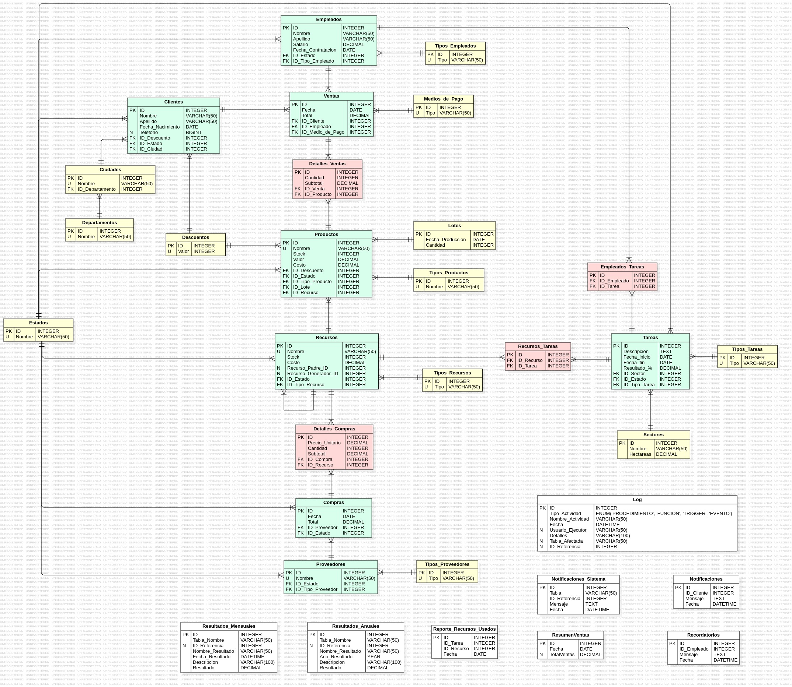

# Proyecto Finca El Primer Mundo

## Descripción del Proyecto

**Finca El Primer Mundo** es un sistema de gestión para una finca que abarca varias funcionalidades, desde el control de empleados y proveedores, hasta la gestión de recursos, ventas, compras, y producción de la finca. Este proyecto implementa una base de datos en MySQL que permite almacenar y gestionar la información clave sobre los diferentes actores y procesos que intervienen en las operaciones de la finca.

### Funcionalidades implementadas:

- **Gestión de Clientes** : Almacena información personal de los clientes y aplica descuentos en las ventas.
- **Control de Empleados** : Registra detalles sobre empleados, sus salarios y tareas asignadas.
- **Administración de Ventas y Compras** : Lleva el registro de las ventas y compras, incluyendo detalles de productos, proveedores y medios de pago.
- **Gestión de Recursos y Productos** : Controla los recursos disponibles en la finca, así como los productos y lotes asociados a la producción.
- **Asignación de Tareas** : Asigna recursos y empleados a tareas dentro de los diferentes sectores de la finca.
- **Notificaciones y Registro de Actividades** : Genera notificaciones y mantiene un log de las operaciones realizadas, como procedimientos, funciones y triggers.

## Diagrama



## Requisitos del Sistema

Para ejecutar este proyecto, se requiere el siguiente software:

- **MySQL** : Versión 8.0 o superior.
- **MySQL Workbench** (opcional pero recomendado): Para gestionar la base de datos de manera visual y ejecutar los scripts SQL.
- **Cliente de línea de comandos de MySQL** : Para ejecutar los archivos `.sql` si no se utiliza MySQL Workbench.
- **Sistema operativo** : Cualquier sistema que soporte MySQL (Windows, Linux, macOS).

## Instalación y Configuración

Sigue los siguientes pasos para configurar el entorno y cargar la base de datos:

### 1. Descargar MySQL y MySQL Workbench

- Descarga e instala MySQL Server desde la página oficial: [https://dev.mysql.com/downloads/mysql/](https://dev.mysql.com/downloads/mysql/)
- (Opcional) Descarga MySQL Workbench: [https://dev.mysql.com/downloads/workbench/](https://dev.mysql.com/downloads/workbench/)

### 2. Crear la Base de Datos

- Abre MySQL Workbench o tu cliente de línea de comandos favorito.
- Ejecuta el archivo `DDL.sql` proporcionado para crear la estructura de la base de datos. Esto incluye la creación de todas las tablas mencionadas anteriormente, así como sus relaciones.

### 3. Cargar Datos Iniciales

- Ejecuta el archivo `DML.sql` para cargar los datos iniciales en las tablas.

### 4. Ejecutar Procedimientos, Funciones, Triggers y Eventos

El proyecto incluye diferentes procedimientos almacenados, funciones, triggers y eventos que gestionan ciertas actividades automáticas en la base de datos. Para ejecutar estos, sigue las instrucciones a continuación:

> [!IMPORTANT]
> **Se deben ejecutar los procesos en el siguiente orden para no generar conflictos**

1. `DQL_Triggers.sql`
2. `DQL_Functions.sql`
3. `DQL_Procedures.sql`
4. `DQL_Events.sql`

Procedimientos y funciones se pueden ejecutar manualmente utilizando el comando `CALL` o `SELECT`.

- Ejemplo para ejecutar un procedimiento almacenado:

  ```sql
  CALL nombre_del_procedimiento(parametros);
  ```
- Ejemplo para ejecutar una función:

  ```sql
  SELECT nombre_de_funcion(parametros);
  ```

- Los triggers y eventos se activan automáticamente cuando ocurren ciertas acciones (como inserciones o actualizaciones) en las tablas asociadas.

## Resumen de la Estructura de la Base de Datos de **Finca El Primer Mundo**

Esta sección presenta las tablas principales que conforman la base de datos, para visualizar una documentación más detallada con tablas secundarias y demas tablas con sus relaciones se recomienda visualizar la documentación de estructura principal localizado en el archivo [index.html](index.html)

### 1. **Clientes**

- **Propósito** : Almacena información personal de los clientes, como nombre, apellido, fecha de nacimiento y su estado actual (activo o inactivo). También está relacionada con las ciudades en las que residen y los descuentos aplicables.
- **Relaciones** :
  - Relacionada con la tabla `Estados` para el estado actual del cliente.
  - Relacionada con `Descuentos` para aplicar promociones.
  - Relacionada con `Ciudades` para almacenar la ubicación del cliente.

### 2. **Empleados**

- **Propósito** : Almacena información sobre los empleados, incluidos su salario, fecha de contratación y el tipo de empleado.
- **Relaciones** :
  - Relacionada con `Estados` para su estado laboral.
  - Relacionada con `Tipos_Empleados` para categorizar el rol del empleado.

### 3. **Ventas**

- **Propósito** : Registra las ventas realizadas por los empleados a los clientes, incluyendo la fecha de venta y el total.
- **Relaciones** :
  - Relacionada con `Clientes` para identificar quién realiza la compra.
  - Relacionada con `Empleados` para saber quién realiza la venta.
  - Relacionada con `Medios_de_Pago` para especificar cómo se realizó el pago.
- **Interacción indirecta** con `Productos` a través de la tabla intermedia `Detalles_Ventas`, que detalla los productos vendidos en cada venta.

### 4. **Productos**

- **Propósito** : Almacena información sobre los productos disponibles, su stock, precio de venta y de coste, así como el descuento aplicable.
- **Relaciones** :
  - Relacionada con `Descuentos` para aplicar descuentos a los productos.
  - Relacionada con `Estados` para indicar si un producto está disponible o no.
  - Relacionada con `Lotes` para gestionar las fechas de producción de cada producto.
  - Relacionada con `Recursos` para asociar los productos con los recursos que los componen.

### 5. **Proveedores**

- **Propósito** : Almacena información sobre los proveedores que suministran recursos a la finca.
- **Relaciones** :
  - Relacionada con `Estados` para el estado actual del proveedor.
  - Relacionada con `Tipos_Proveedores` para clasificar el tipo de proveedor.

### 6. **Recursos**

- **Propósito** : Contiene la información de los recursos que la finca utiliza o produce, como herramientas, fertilizantes, o materias primas.
- **Relaciones** :
  - Relacionada con `Estados` para indicar la disponibilidad del recurso.
  - Relacionada con `Tipos_Recursos` para categorizar el tipo de recurso.
  - Puede tener una relación consigo misma a través de los campos `Recurso_Padre_ID` y `Recurso_Generador_ID` para modelar recursos que dependen de otros.
- **Interacción indirecta** con `Compras` mediante la tabla intermedia `Detalles_Compras`, que relaciona los recursos comprados.

### 7. **Compras**

- **Propósito** : Registra las compras realizadas a los proveedores, con el total de la compra y la fecha.
- **Relaciones** :
  - Relacionada con `Proveedores` para identificar quién suministró los recursos.
  - Relacionada con `Estados` para el estado de la compra (completada, pendiente, etc.).
- **Interacción indirecta** con `Recursos` a través de la tabla intermedia `Detalles_Compras`, que detalla los recursos adquiridos en cada compra.

### 8. **Tareas**

- **Propósito** : Almacena las actividades que se realizan en la finca, como plantación, cosecha, o mantenimiento. Incluye detalles como fecha de inicio, fin, y porcentaje de cumplimiento.
- **Relaciones** :
- Relacionada con `Sectores` para saber en qué parte de la finca se realiza la tarea.
- Relacionada con `Estados` para indicar el progreso de la tarea.
- Relacionada con `Tipos_Tareas` para clasificar el tipo de actividad.
- **Interacción indirecta** con `Empleados` y `Recursos` mediante las tablas intermedias `Empleados_Tareas` y `Recursos_Tareas`, que indican qué empleados participaron y qué recursos se utilizaron.

## Ejemplificación de Consultas

Esta sección presenta algunas de las consultas posibles, habiendo más prediseñadas en `DQL_Select.sql`

### 1. **Consulta básica - Productos con su estado actual**

Esta consulta muestra todos los productos de la base de datos junto con su stock, valor, costo y el estado actual del producto.

```sql
SELECT
    pr.Nombre,
    pr.Stock,
    pr.Valor,
    pr.Costo,
    es.Nombre AS Estado
FROM Productos pr
INNER JOIN Estados es ON pr.ID_Estado = es.ID;
```

**Descripción:** Proporciona una visión general de todos los productos, mostrando su estado en el sistema, lo que facilita la gestión de inventarios.

### 2. **Consulta avanzada - Productos con descuento**

Esta consulta muestra todos los productos junto con su porcentaje de descuento y el valor del descuento aplicado.

```sql
SELECT
    pr.Nombre,
    pr.Stock,
    pr.Valor,
    pr.Costo,
    CONCAT(de.Valor,"%") AS Descuento,
    CalcularDescuentoProducto(pr.ID) AS ValorDescuento
FROM Productos pr
INNER JOIN Descuentos de ON pr.ID_Descuento = de.ID;
```

**Descripción:** Útil para gestionar promociones y descuentos en productos, mostrando tanto el porcentaje como el valor monetario de cada descuento aplicado.

### 3. **Consulta básica - Tipo de producto**

Esta consulta muestra el tipo de cada producto utilizando una función que obtiene la clasificación del producto.

```sql
SELECT
    Nombre,
    Stock,
    Valor,
    Costo,
    ObtenerTipoProducto(ID) AS TipoProducto
FROM Productos;

```

**Descripción:** Facilita la visualización de las categorías de productos disponibles en la base de datos.

### 4. **Consulta avanzada - Lotes de productos**

Esta consulta muestra los productos junto con la información sobre los lotes a los que pertenecen.

```sql
SELECT
    pr.Nombre,
    pr.Stock,
    pr.Valor,
    pr.Costo,
    lo.Cantidad,
    lo.Fecha_Produccion
FROM Productos pr
INNER JOIN Lotes lo ON pr.ID_Lote = lo.ID;
```

**Descripción:** Proporciona detalles sobre la producción de los productos, lo que es vital para la trazabilidad y control de calidad.

### 5. **Consulta avanzada - Recursos de productos**

Esta consulta muestra los productos con los recursos específicos que están asociados a cada uno, junto con el stock y costo de dichos recursos.

```sql
SELECT
    pr.Nombre,
    pr.Stock,
    pr.Valor,
    pr.Costo,
    re.Nombre AS Recurso,
    re.Stock AS RecursoStock,
    re.Costo AS RecursoCosto
FROM Productos pr
INNER JOIN Recursos re ON pr.ID_Recurso = re.ID;
```

**Descripción:** Es útil para ver qué recursos se requieren para cada producto, permitiendo una mejor planificación de inventario.

### 6. **Consulta avanzada - Ventas con productos relacionados**

Esta consulta muestra las ventas, incluyendo detalles de los productos vendidos y la información sobre su stock, valor y costo.

```sql
SELECT
    ve.Fecha,
    ve.Total,
    dv.Cantidad,
    dv.Subtotal,
    pr.Nombre AS Producto,
    pr.Stock,
    pr.Valor,
    pr.Costo
FROM Detalles_Ventas dv
INNER JOIN Ventas ve ON dv.ID_Venta = ve.ID
INNER JOIN Productos pr ON dv.ID_Producto = pr.ID;

```

**Descripción:** Proporciona un resumen completo de cada venta y los productos relacionados, lo que es esencial para el análisis de ventas y la gestión de inventarios.

## Ejemplificación Procedimientos, Funciones, Triggers y Eventos en el Sistema

En este sistema, se han creado diversos procedimientos almacenados, funciones, triggers y eventos para automatizar tareas, mantener la integridad de los datos y realizar cálculos y operaciones rutinarias. En esta sección se explica brevemente algunos de ellos, cada `DQL` respectivo al tipo de actividad contiene más de estos prediseñados.

### 1. **Procedimientos Almacenados**

**Ejemplos:**

- **InsertarCliente** : Inserta un nuevo cliente en la base de datos. Se utiliza para registrar clientes de manera estructurada y mantener un log de la operación.
- **ActualizarCliente** : Actualiza la información de un cliente existente según su ID.
- **EliminarCliente** : Elimina un cliente del sistema, siempre que no existan restricciones en su eliminación.
- **InsertarProducto** : Agrega un nuevo producto, asegurando que la información se registre correctamente.

Cada [procedimiento](DQL/DQL_Procedures.sql) también registra las operaciones en una tabla de logs para mantener un historial de los cambios y acciones realizadas en la base de datos.

### 2. **Funciones**

**Ejemplos:**

- **NombreCompletoCliente** : Devuelve el nombre completo de un cliente a partir de su ID.
- **TotalVentasCliente** : Calcula el total de ventas realizadas por un cliente.
- **ObtenerPrecioProducto** : Devuelve el precio actual de un producto a partir de su ID.

Estas [funciones](DQL/DQL_Functions.sql) son útiles para obtener resultados específicos rápidamente y también mantienen registros en los logs.

### 3. **Triggers (Disparadores)**

**Ejemplos:**

- **RegistroCliente** : Al insertar un nuevo cliente, se agrega automáticamente un registro en la tabla de logs.
- **ActualizarStockVenta** : Cada vez que se inserta un detalle de venta, el stock del producto correspondiente se actualiza.
- **PrevenirEliminacionVentas** : Evita que se elimine un producto si tiene ventas asociadas, preservando la integridad referencial de los datos.

Estos [triggers](DQL/DQL_Triggers.sql) garantizan que los cambios críticos se manejen automáticamente y se registren de manera adecuada.

### 4. **Eventos (Events)**

**Ejemplos:**

- **LimpiarPreciosProductos** : Limpia los registros de precios de productos antiguos cada 6 meses.
- **CancelarProductos** : Actualiza el stock a cero y cambia el estado a "cancelado" de productos que no han tenido ventas en un año.
- **NotificarClientesInactivos** : Envía notificaciones a clientes inactivos mensualmente.
- **ResumenVentasDiario** : Genera un resumen diario de las ventas realizadas.

Estos [eventos](DQL/DQL_Events.sql) permiten mantener la base de datos optimizada y actualizada sin intervención manual constante.

## Roles de Usuario y Permisos

En el sistema de la base de datos **Finca El Primer Mundo** , se han definido cinco roles de usuario, cada uno con permisos específicos para interactuar con distintas tablas y funcionalidades. A continuación, se describen estos roles y los permisos que tienen asignados.

### 1. Administrador

- **Descripción** : Este rol tiene acceso total a todas las tablas y operaciones dentro de la base de datos.
- **Permisos** :
  - Puede realizar todas las operaciones (`SELECT`, `INSERT`, `UPDATE`, `DELETE`) en todas las tablas de la base de datos.
- **Instrucción para crear el usuario y asignar permisos** :

```sql
CREATE USER 'AdministradorFinca'@'localhost' IDENTIFIED BY 'QLD3214@rtv';
GRANT ALL PRIVILEGES ON Finca_El_Primer_Mundo.* TO 'AdministradorFinca'@'localhost';
```

### 2. Vendedor

- **Descripción** : El vendedor puede gestionar las ventas, clientes y visualizar productos.
- **Permisos** :
  - `Ventas`: Puede `SELECT`, `INSERT`, y `UPDATE`.
  - `Detalles_Ventas`: Puede `SELECT`, `INSERT`, y `UPDATE`.
  - `Clientes`: Puede `SELECT`, `INSERT`.
  - `Productos`: Puede `SELECT` (solo visualizar productos).
- **Instrucción para crear el usuario y asignar permisos** :

```sql
CREATE USER 'VendedorFinca'@'localhost' IDENTIFIED BY 'SDQ3324@fes';
GRANT SELECT, INSERT, UPDATE ON Finca_El_Primer_Mundo.Ventas TO 'VendedorFinca'@'localhost';
GRANT SELECT, INSERT, UPDATE ON Finca_El_Primer_Mundo.Detalles_Ventas TO 'VendedorFinca'@'localhost';
GRANT SELECT, INSERT ON Finca_El_Primer_Mundo.Clientes TO 'VendedorFinca'@'localhost';
GRANT SELECT ON Finca_El_Primer_Mundo.Productos TO 'VendedorFinca'@'localhost';

```

### 3. Contador

- **Descripción** : El contador puede consultar información sobre ventas y compras, pero no modificarla.
- **Permisos** :
  - `Ventas`: Puede `SELECT`.
  - `Detalles_Ventas`: Puede `SELECT`.
  - `Compras`: Puede `SELECT`.
  - `Detalles_Compras`: Puede `SELECT`.
- **Instrucción para crear el usuario y asignar permisos** :

```sql
CREATE USER 'ContadorFinca'@'localhost' IDENTIFIED BY 'HTG1224@dac';
GRANT SELECT ON Finca_El_Primer_Mundo.Ventas TO 'ContadorFinca'@'localhost';
GRANT SELECT ON Finca_El_Primer_Mundo.Detalles_Ventas TO 'ContadorFinca'@'localhost';
GRANT SELECT ON Finca_El_Primer_Mundo.Compras TO 'ContadorFinca'@'localhost';
GRANT SELECT ON Finca_El_Primer_Mundo.Detalles_Compras TO 'ContadorFinca'@'localhost';
```

### 4. Cliente

- **Descripción** : El cliente solo puede visualizar información de los productos disponibles.
- **Permisos** :
  - `Productos`: Puede `SELECT` sobre campos específicos (`ID`, `Nombre`, `Stock`, `Valor`, `ID_Descuento`, `ID_Estado`, `ID_Tipo_Producto`, `ID_Lote`).
- **Instrucción para crear el usuario y asignar permisos** :

```sql
CREATE USER 'ClienteFinca'@'localhost' IDENTIFIED BY 'TGDD3684@bnf';
GRANT SELECT (ID, Nombre, Stock, Valor, ID_Descuento, ID_Estado, ID_Tipo_Producto, ID_Lote) ON Finca_El_Primer_Mundo.Productos TO 'ClienteFinca'@'localhost';
```

### 5. Especialista de Inventario

- **Descripción** : El especialista de inventario tiene permisos para gestionar recursos y proveedores, así como las compras asociadas.
- **Permisos** :
  - `Recursos`: Puede `SELECT`, `INSERT`, `UPDATE`.
  - `Detalles_Compras`: Puede `SELECT`, `INSERT`, `UPDATE`.
  - `Compras`: Puede `SELECT`, `INSERT`, `UPDATE`.
  - `Proveedores`: Puede `SELECT`.
- **Instrucción para crear el usuario y asignar permisos** :

```sql
CREATE USER 'EspecialistaDeInventarioFinca'@'localhost' IDENTIFIED BY 'GHJ859@fer';
GRANT SELECT, INSERT, UPDATE ON Finca_El_Primer_Mundo.Recursos TO 'EspecialistaDeInventarioFinca'@'localhost';
GRANT SELECT, INSERT, UPDATE ON Finca_El_Primer_Mundo.Detalles_Compras TO 'EspecialistaDeInventarioFinca'@'localhost';
GRANT SELECT, INSERT, UPDATE ON Finca_El_Primer_Mundo.Compras TO 'EspecialistaDeInventarioFinca'@'localhost';
GRANT SELECT ON Finca_El_Primer_Mundo.Proveedores TO 'EspecialistaDeInventarioFinca'@'localhost';
```

### Instrucciones para la Creación de Usuarios y Asignación de Roles en MySQL

1. **Crear un nuevo usuario en MySQL** : Utiliza el comando `CREATE USER`, especificando el nombre de usuario, host, y la contraseña.

```sql
CREATE USER 'nombre_usuario'@'localhost' IDENTIFIED BY 'contraseña';
```

2. **Asignar permisos a un usuario** : Utiliza el comando `GRANT` para otorgar permisos específicos sobre una tabla o base de datos.

```sql
GRANT permisos ON nombre_base_datos.nombre_tabla TO 'nombre_usuario'@'localhost';
```

3. **Aplicar los cambios** : Después de asignar los permisos, asegúrate de aplicar los cambios ejecutando el comando:

```sql
FLUSH PRIVILEGES;
```

4. **Revocar permisos (opcional)** : Si necesitas revocar un permiso, utiliza el comando `REVOKE`.

```sql
REVOKE permisos ON nombre_base_datos.nombre_tabla FROM 'nombre_usuario'@'localhost';
```

## Autoría ✒️

Las contribuciones en este proyecto y sus respectivas tareas fueron de los siguientes usuarios:

### [KevinJGV](https://github.com/KevinJGV)

- Principal Modelado y Desarrollo para la estructura de la base de datos
- Inserción de registros
- Desarrollo de:
  - 17 Funciones
  - 11 Triggers
  - 10 Procedimientos almacenados
  - 10 Eventos
- Documentación Readme y UML (Localizado en el archivo [index.html](index.html))
- x Consultas

### [Javier Eduardo Acevedo Noguera](https://github.com/JavierEAcevedoN)

- Complementación en la estructura de la base de datos
- Desarrollo de:
  - 10 Funciones
  - 11 Triggers
  - 10 Procedimientos almacenados
  - 10 Eventos
- Implementación de usuarios
- x Consultas

## Licencia

El presente Software es de uso libre.

Contacto - [kejogo.dev@outlook.com](mailto:kejogo.dev@outlook.com)
