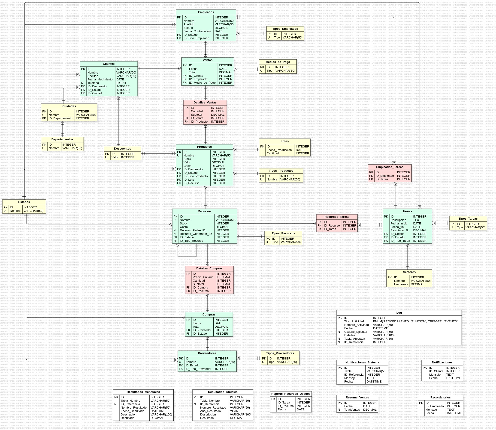

# Proyecto Finca El Primer Mundo

## Descripción del Proyecto

**Finca El Primer Mundo** es un sistema de gestión para una finca que abarca varias funcionalidades, desde el control de empleados y proveedores, hasta la gestión de recursos, ventas, compras, y producción de la finca. Este proyecto implementa una base de datos en MySQL que permite almacenar y gestionar la información clave sobre los diferentes actores y procesos que intervienen en las operaciones de la finca.

### Funcionalidades implementadas:

* **Gestión de Clientes** : Almacena información personal de los clientes y aplica descuentos en las ventas.
* **Control de Empleados** : Registra detalles sobre empleados, sus salarios y tareas asignadas.
* **Administración de Ventas y Compras** : Lleva el registro de las ventas y compras, incluyendo detalles de productos, proveedores y medios de pago.
* **Gestión de Recursos y Productos** : Controla los recursos disponibles en la finca, así como los productos y lotes asociados a la producción.
* **Asignación de Tareas** : Asigna recursos y empleados a tareas dentro de los diferentes sectores de la finca.
* **Notificaciones y Registro de Actividades** : Genera notificaciones y mantiene un log de las operaciones realizadas, como procedimientos, funciones y triggers.

## Diagrama



## Requisitos del Sistema

Para ejecutar este proyecto, se requiere el siguiente software:

* **MySQL** : Versión 8.0 o superior.
* **MySQL Workbench** (opcional pero recomendado): Para gestionar la base de datos de manera visual y ejecutar los scripts SQL.
* **Cliente de línea de comandos de MySQL** : Para ejecutar los archivos `.sql` si no se utiliza MySQL Workbench.
* **Sistema operativo** : Cualquier sistema que soporte MySQL (Windows, Linux, macOS).

## Instalación y Configuración

Sigue los siguientes pasos para configurar el entorno y cargar la base de datos:

### 1. Descargar MySQL y MySQL Workbench

* Descarga e instala MySQL Server desde la página oficial: [https://dev.mysql.com/downloads/mysql/](https://dev.mysql.com/downloads/mysql/)
* (Opcional) Descarga MySQL Workbench: [https://dev.mysql.com/downloads/workbench/](https://dev.mysql.com/downloads/workbench/)

### 2. Crear la Base de Datos

* Abre MySQL Workbench o tu cliente de línea de comandos favorito.
* Ejecuta el archivo `DDL.sql` proporcionado para crear la estructura de la base de datos. Esto incluye la creación de todas las tablas mencionadas anteriormente, así como sus relaciones.

### 3. Cargar Datos Iniciales

* Ejecuta el archivo `DML.sql` para cargar los datos iniciales en las tablas.

### 4. Ejecutar Procedimientos, Funciones, Triggers y Eventos

El proyecto incluye diferentes procedimientos almacenados, funciones, triggers y eventos que gestionan ciertas actividades automáticas en la base de datos. Para ejecutar estos, sigue las instrucciones a continuación:

* Se deben ejecutar los procesos en el siguiente orden para no generar conflictos:
  1. `DQL_Triggers.sql`
  2. `DQL_Functions.sql`
  3. `DQL_Procedures.sql`
  4. `DQL_Events.sql`
* Procedimientos y funciones se pueden ejecutar manualmente utilizando el comando `CALL` o `SELECT`.

Ejemplo para ejecutar un procedimiento almacenado:

```sql
CALL nombre_del_procedimiento(parametros);
```

Ejemplo para ejecutar una función:

```sql
SELECT nombre_de_funcion(parametros);
```

- Los triggers y eventos se activan automáticamente cuando ocurren ciertas acciones (como inserciones o actualizaciones) en las tablas asociadas.


## Roles de Usuario y Permisos

En el sistema de la base de datos  **Finca El Primer Mundo** , se han definido cinco roles de usuario, cada uno con permisos específicos para interactuar con distintas tablas y funcionalidades. A continuación, se describen estos roles y los permisos que tienen asignados.

### 1. Administrador

* **Descripción** : Este rol tiene acceso total a todas las tablas y operaciones dentro de la base de datos.
* **Permisos** :
* Puede realizar todas las operaciones (`SELECT`, `INSERT`, `UPDATE`, `DELETE`) en todas las tablas de la base de datos.
* **Instrucción para crear el usuario y asignar permisos** :

```sql
CREATE USER 'AdministradorFinca'@'localhost' IDENTIFIED BY 'QLD3214@rtv';
GRANT ALL PRIVILEGES ON Finca_El_Primer_Mundo.* TO 'AdministradorFinca'@'localhost';
```

### 2. Vendedor

* **Descripción** : El vendedor puede gestionar las ventas, clientes y visualizar productos.
* **Permisos** :
* `Ventas`: Puede `SELECT`, `INSERT`, y `UPDATE`.
* `Detalles_Ventas`: Puede `SELECT`, `INSERT`, y `UPDATE`.
* `Clientes`: Puede `SELECT`, `INSERT`.
* `Productos`: Puede `SELECT` (solo visualizar productos).
* **Instrucción para crear el usuario y asignar permisos** :

```sql
CREATE USER 'VendedorFinca'@'localhost' IDENTIFIED BY 'SDQ3324@fes';
GRANT SELECT, INSERT, UPDATE ON Finca_El_Primer_Mundo.Ventas TO 'VendedorFinca'@'localhost';
GRANT SELECT, INSERT, UPDATE ON Finca_El_Primer_Mundo.Detalles_Ventas TO 'VendedorFinca'@'localhost';
GRANT SELECT, INSERT ON Finca_El_Primer_Mundo.Clientes TO 'VendedorFinca'@'localhost';
GRANT SELECT ON Finca_El_Primer_Mundo.Productos TO 'VendedorFinca'@'localhost';

```

### 3. Contador

* **Descripción** : El contador puede consultar información sobre ventas y compras, pero no modificarla.
* **Permisos** :
* `Ventas`: Puede `SELECT`.
* `Detalles_Ventas`: Puede `SELECT`.
* `Compras`: Puede `SELECT`.
* `Detalles_Compras`: Puede `SELECT`.
* **Instrucción para crear el usuario y asignar permisos** :

```sql
CREATE USER 'ContadorFinca'@'localhost' IDENTIFIED BY 'HTG1224@dac';
GRANT SELECT ON Finca_El_Primer_Mundo.Ventas TO 'ContadorFinca'@'localhost';
GRANT SELECT ON Finca_El_Primer_Mundo.Detalles_Ventas TO 'ContadorFinca'@'localhost';
GRANT SELECT ON Finca_El_Primer_Mundo.Compras TO 'ContadorFinca'@'localhost';
GRANT SELECT ON Finca_El_Primer_Mundo.Detalles_Compras TO 'ContadorFinca'@'localhost';
```

### 4. Cliente

* **Descripción** : El cliente solo puede visualizar información de los productos disponibles.
* **Permisos** :
* `Productos`: Puede `SELECT` sobre campos específicos (`ID`, `Nombre`, `Stock`, `Valor`, `ID_Descuento`, `ID_Estado`, `ID_Tipo_Producto`, `ID_Lote`).
* **Instrucción para crear el usuario y asignar permisos** :

```sql
CREATE USER 'ClienteFinca'@'localhost' IDENTIFIED BY 'TGDD3684@bnf';
GRANT SELECT (ID, Nombre, Stock, Valor, ID_Descuento, ID_Estado, ID_Tipo_Producto, ID_Lote) ON Finca_El_Primer_Mundo.Productos TO 'ClienteFinca'@'localhost';
```

### 5. Especialista de Inventario

* **Descripción** : El especialista de inventario tiene permisos para gestionar recursos y proveedores, así como las compras asociadas.
* **Permisos** :
* `Recursos`: Puede `SELECT`, `INSERT`, `UPDATE`.
* `Detalles_Compras`: Puede `SELECT`, `INSERT`, `UPDATE`.
* `Compras`: Puede `SELECT`, `INSERT`, `UPDATE`.
* `Proveedores`: Puede `SELECT`.
* **Instrucción para crear el usuario y asignar permisos** :

```sql
CREATE USER 'EspecialistaDeInventarioFinca'@'localhost' IDENTIFIED BY 'GHJ859@fer';
GRANT SELECT, INSERT, UPDATE ON Finca_El_Primer_Mundo.Recursos TO 'EspecialistaDeInventarioFinca'@'localhost';
GRANT SELECT, INSERT, UPDATE ON Finca_El_Primer_Mundo.Detalles_Compras TO 'EspecialistaDeInventarioFinca'@'localhost';
GRANT SELECT, INSERT, UPDATE ON Finca_El_Primer_Mundo.Compras TO 'EspecialistaDeInventarioFinca'@'localhost';
GRANT SELECT ON Finca_El_Primer_Mundo.Proveedores TO 'EspecialistaDeInventarioFinca'@'localhost';
```

### Instrucciones para la Creación de Usuarios y Asignación de Roles en MySQL

1. **Crear un nuevo usuario en MySQL** : Utiliza el comando `CREATE USER`, especificando el nombre de usuario, host, y la contraseña.

```sql
CREATE USER 'nombre_usuario'@'localhost' IDENTIFIED BY 'contraseña';
```

2. **Asignar permisos a un usuario** : Utiliza el comando `GRANT` para otorgar permisos específicos sobre una tabla o base de datos.

```sql
GRANT permisos ON nombre_base_datos.nombre_tabla TO 'nombre_usuario'@'localhost';
```

3. **Aplicar los cambios** : Después de asignar los permisos, asegúrate de aplicar los cambios ejecutando el comando:

```sql
FLUSH PRIVILEGES;
```

4. **Revocar permisos (opcional)** : Si necesitas revocar un permiso, utiliza el comando `REVOKE`.

```sql
REVOKE permisos ON nombre_base_datos.nombre_tabla FROM 'nombre_usuario'@'localhost';
```
